# Observability Stack for Kubernetes (Monitoring + Alerting)

Kubernetes observability platform using Prometheus, Grafana, Alertmanager, node-exporter, kube-state-metrics, and a custom metrics app. Deployed via Helm into an AWS-hosted Kubernetes cluster created by Terraform.

```mermaid
flowchart LR
  %% =====================
  %% People
  %% =====================
  User[👤 User<br/>Views dashboards & alerts]:::person

  %% =====================
  %% System Boundary
  %% =====================
  subgraph System["📊 Observability Platform (AWS EKS)"]
    direction LR

    %% Containers
    App[📦 Custom Metrics App<br/><small>Exposes business metrics</small>]:::container
    Svc[🔌 Kubernetes Service<br/><small>Metrics endpoint</small>]:::container

    Prom[📈 Prometheus<br/><small>Metrics scraping & storage</small>]:::container
    AM[🚨 Alertmanager<br/><small>Alert routing & grouping</small>]:::container
    Graf[📉 Grafana<br/><small>Visualization & dashboards</small>]:::container

    NE[🖥️ node-exporter<br/><small>Node-level metrics</small>]:::container
    KSM[☸️ kube-state-metrics<br/><small>Kubernetes object metrics</small>]:::container
  end

  %% =====================
  %% External Systems
  %% =====================
  Notify[📬 Notification Systems<br/><small>Slack / Email / PagerDuty</small>]:::external

  %% =====================
  %% Relationships
  %% =====================
  User -->|Views dashboards| Graf
  User -->|Receives alerts| Notify

  App -->|Exposes metrics| Svc
  Svc -->|Scraped via /metrics| Prom

  Prom -->|Scrapes metrics| NE
  Prom -->|Scrapes metrics| KSM
  Prom -->|Evaluates rules| AM
  Prom -->|Queries metrics| Graf

  AM -->|Sends alerts| Notify

  %% =====================
  %% Styling
  %% =====================
  classDef person fill:#E3F2FD,stroke:#1E88E5,stroke-width:2px
  classDef container fill:#FFFFFF,stroke:#424242,stroke-width:1.5px
  classDef external fill:#FFF3E0,stroke:#FB8C00,stroke-width:2px

  style System fill:#FAFAFA,stroke:#90A4AE,stroke-width:2px


```

## layout

- `terraform-cluster/` - EKS cluster provisioning (VPC + EKS).
- `helm-values/` - Helm values for kube-prometheus-stack.
- `prometheus-config/` - Alert rules and Prometheus config snippets.
- `grafana-dashboards/` - Custom dashboards.
- `custom-metrics-app/` - App exposing metrics endpoint.
- `docs/` - Architecture, screenshots, and alert examples.

## Deploy flow

1. Provision the cluster using `terraform-cluster/`.
2. Install kube-prometheus-stack with values from `helm-values/`.
3. Apply alert rules from `prometheus-config/`.
4. Deploy `custom-metrics-app/` and verify metrics scrape.
5. Import dashboards from `grafana-dashboards/`.
